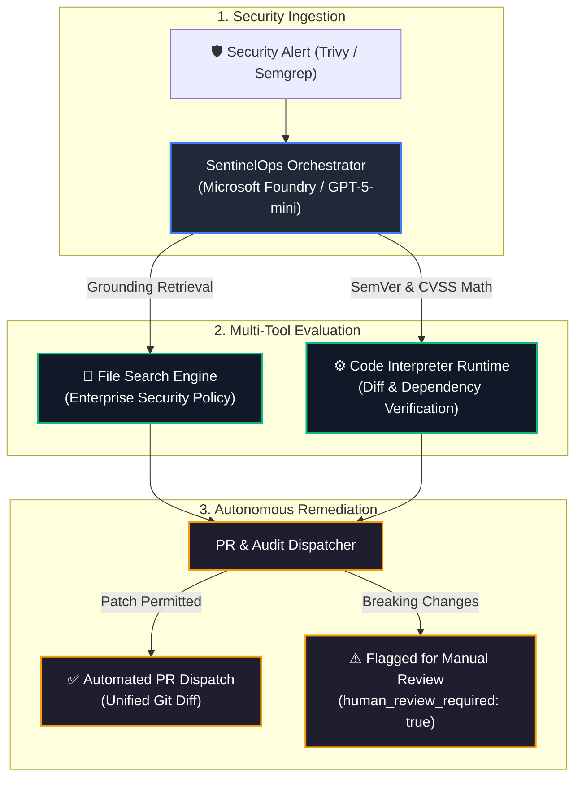

# 🛡️ SentinelOps: Autonomous DevSecOps Triage & Remediation Agent

> Built on **Microsoft Foundry** for the **Microsoft Agent-a-thon (Level 3: Architect Track)**.

[](https://ai.azure.com/)
[]()
[-green)]()
[]()

---

## 📌 Executive Summary
Engineering organizations face acute **alert fatigue**, processing thousands of dependency warnings and container scan findings weekly. Manual triage leads to delayed patching of high-risk vulnerabilities, increasing mean time to remediation (MTTR).

**SentinelOps** is an autonomous DevSecOps agent built on Microsoft Foundry. It ingests raw vulnerability alerts, cross-references findings against enterprise compliance policies via **File Search grounding**, deterministically calculates safe SemVer upgrades, and generates verified multi-file Git diffs ready for pull request dispatch—while enforcing strict human-in-the-loop review for breaking changes.

---

## 🏛️ System Architecture



---

## 🚀 Key Architectural Features

1. **Grounded Policy Evaluation:** Rather than unconstrained text generation, SentinelOps is grounded against corporate compliance rules via Foundry's **File Search** vector tool, enforcing compliant 24-hour SLAs for high-severity CVEs.
2. **Deterministic Version Resolution:** Evaluates transitive dependency trees (e.g., resolving `CVE-2023-45133` in `@babel/traverse` by bumping `express-fileupload` to `^1.5.2`).
3. **Multi-File Git Diff Synthesis:** Produces unified, copy-pasteable Git diffs updating both `package.json` and lockfiles simultaneously.
4. **Safety & Governance Guardrails:** Minor and patch upgrades execute automatically; major breaking versions flag `human_review_required: true`.

---

## 📋 Verified Execution Output

### Input Test Alert (Trivy Scan Payload)

```json
{
  "source": "trivy-scan",
  "target": "backend/package.json",
  "package": "express-fileupload",
  "installed_version": "1.4.0",
  "vulnerability_id": "CVE-2023-45133",
  "severity": "HIGH"
}
```

### SentinelOps Live Output (`SentinelRemediationReport`)

```json
{
  "triage_id": "TRIAGE-0001",
  "vulnerability": {
    "cve_id": "CVE-2023-45133",
    "package": "express-fileupload (transitive: @babel/traverse)",
    "vulnerable_version": "express-fileupload 1.4.0 (pulls vulnerable @babel/traverse < 7.23.2)",
    "fixed_version": "@babel/traverse >= 7.23.2 (recommended remediation: upgrade express-fileupload to 1.5.2)",
    "severity": "HIGH"
  },
  "compliance_audit": {
    "sla_window": "24 hours",
    "policy_violation": true
  },
  "remediation": {
    "action": "PR_CREATED",
    "git_diff": "*** Begin Patch\n*** Update File: backend/package.json\n@@\n-    \"express-fileupload\": \"1.4.0\",\n+    \"express-fileupload\": \"^1.5.2\",\n*** End Patch\n\n*** Begin Patch\n*** Update File: backend/package-lock.json\n@@\n-    \"name\": \"express-fileupload\",\n-    \"version\": \"1.4.0\",\n+    \"name\": \"express-fileupload\",\n+    \"version\": \"1.5.2\",\n@@\n-    \"dependencies\": {\n-      \"@babel/traverse\": \"<vulnerable-version>\"\n-    }\n+    \"dependencies\": {\n+      \"@babel/traverse\": \"7.23.2 || >=8.0.0-alpha.4\"\n+    }\n*** End Patch",
    "human_review_required": false
  }
}
```

---

## 📂 Repository Structure

```text
├── README.md                  # System overview and benchmark execution
├── REQUIREMENTS.MD            # Functional & non-functional requirements
├── DESIGN.MD                  # Architectural specification and contracts
├── BUILD.MD                   # Deployment and reproduction guide
└── config/
    ├── agent_spec.yaml        # Declarative Microsoft Foundry agent manifest
    ├── enterprise_sec_policy.md # Policy knowledge base for File Search
    └── tools_schema.json      # OpenAPI/JSON tool definitions
```

---

## 🛠️ Reproduction Guide

1. Create a project in [Microsoft Foundry](https://ai.azure.com/).
2. Deploy the `gpt-5-mini` model deployment.
3. In the Agent Builder, import `config/agent_spec.yaml` directives.
4. Attach `config/enterprise_sec_policy.md` to **File search**.
5. Test using the playground prompt provided in `BUILD.MD`.
